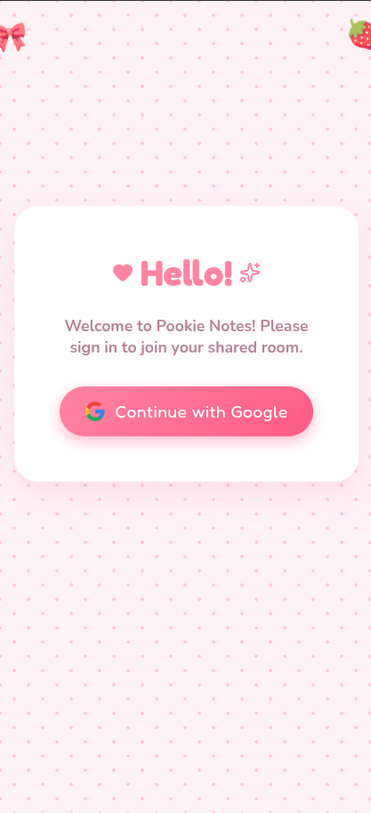
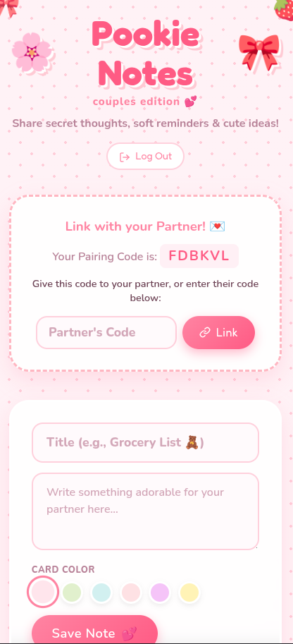
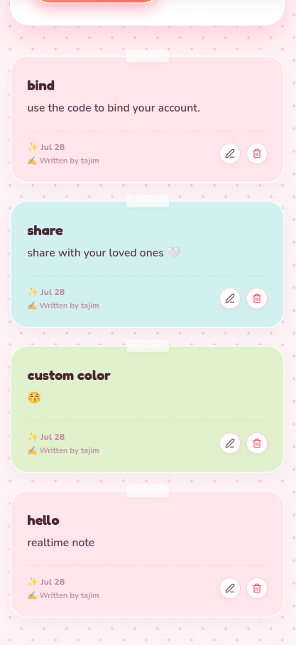

# 🌸 Pookie Notes — Couples Edition 💕

A cute, private notes app built for two. Sign in with Google, pair up with your partner using a one-time code, and share a little room of sticky notes that updates for both of you in real time.

## Features

- **Google sign-in** — no passwords, just Google OAuth via Supabase Auth.
- **Partner pairing** — every new user gets a unique pairing code; share it with your partner to link your two accounts into a single "couple" room. Pairing requires the room owner's approval before it's finalized.
- **Shared sticky notes** — create, edit, and delete notes with a title, content, and a pastel color of your choice.
- **Realtime sync** — notes and pairing status update instantly for both partners via Supabase Realtime, with no page refresh or flicker.
- **Attribution** — every note shows who wrote it, and who last edited it if it's been changed.

## Screenshots

| Sign in | Shared notes room | Editing a note |
|---|---|---|
|  |  |  |

## Tech Stack

- [React 19](https://react.dev/) + [TypeScript](https://www.typescriptlang.org/)
- [Vite](https://vite.dev/) for tooling and dev server
- [Supabase](https://supabase.com/) for auth, Postgres database, row-level security, and realtime subscriptions
- [lucide-react](https://lucide.dev/) for icons

## Getting Started

### Prerequisites

- Node.js 18+
- A [Supabase](https://supabase.com/) project with Google OAuth configured

### 1. Install dependencies

```bash
npm install
```

### 2. Configure environment variables

Create a `.env.local` file in the project root:

```bash
VITE_SUPABASE_URL=your-supabase-project-url
VITE_SUPABASE_ANON_KEY=your-supabase-anon-key
```

### 3. Set up the database

Run the SQL in [`supabase/supabase.sql`](supabase/supabase.sql) against your Supabase project (via the SQL Editor in the Supabase dashboard). It creates the `profiles`, `couples`, and `notes` tables along with the row-level security policies that keep each couple's notes private to just the two of them.

> ⚠️ The script starts by dropping these tables (and deleting all `auth.users`) so you begin from a clean slate — only run it on a fresh project.

### 4. Run the dev server

```bash
npm run dev
```

### 5. Build for production

```bash
npm run build
```

## How pairing works

1. When you sign in for the first time, you pick a nickname and get a unique pairing code.
2. Share that code with your partner. They enter it on their own pairing screen.
3. You'll see a "Knock Knock!" request to approve — once approved, your two accounts share the same notes room.
4. From then on, notes either of you create, edit, or delete sync instantly for both of you.

## Deployment

See [`docs/DEPLOY.md`](docs/DEPLOY.md) for deployment instructions.
